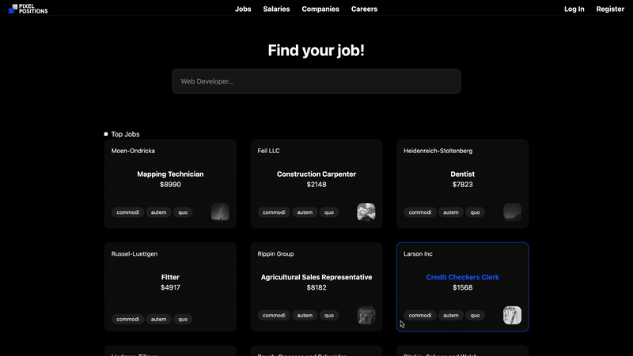

# Laravel Jobs Website 🚀


!

Welcome to **Laravel Jobs Website**, a modern web application built with Laravel 11, inspired by the "30 Days to Learn Laravel 11" series (Episode 30) from Laracasts. This project is a fully functional blog or CMS with user authentication, CRUD operations, and a sleek, responsive design. Perfect for learning Laravel or deploying a lightweight blog! 📝

## ✨ Features

- 🛡️ **User Authentication**: Secure login and registration system.
- 📝 **CRUD Operations**: Create, read, update, and delete blog posts.
- 🎨 **Responsive Design**: Built with Tailwind CSS for a modern, mobile-friendly UI.
- 🗄️ **Database Management**: Uses Laravel's Eloquent ORM and migrations.
- ⚡ **Fast Setup**: Quick installation with Vite for asset bundling.

## 📋 Requirements

| Dependency        | Version       |
|-------------------|---------------|
| PHP               | >= 8.1       |
| Composer          | Latest       |
| Node.js & npm     | Latest       |
| Database          | PostgreSQL/SQLite |
| Laravel           | 11.x         |

## 🛠️ Installation

Follow these steps to get the project up and running locally:

1. **Clone the repository**:
   ```bash
   git clone https://github.com/your-username/laravel-blog.git
   cd laravel-blog
   ```

2. **Install PHP dependencies**:
   ```bash
   composer install
   ```

3. **Install JavaScript dependencies**:
   ```bash
   npm install && npm run dev
   ```

4. **Set up environment file**:
   Copy the `.env.example` to `.env` and configure your database:
   ```bash
   cp .env.example .env
   ```
   Update `.env` with your database settings (e.g., `DB_CONNECTION`, `DB_DATABASE`).

5. **Generate application key**:
   ```bash
   php artisan key:generate
   ```

6. **Run migrations**:
   ```bash
   php artisan migrate
   ```

7. **Seed the database** (optional):
   ```bash
   php artisan db:seed
   ```

8. **Start the development server**:
   ```bash
   php artisan serve
   ```
   Access the app at `http://localhost:8000`.

## 🚀 Usage

- **Register/Login**: Sign up or log in to access the dashboard.
- **Create Posts**: Add new blog posts with a user-friendly interface.
- **Manage Content**: Edit or delete posts from the dashboard.
- **Browse Posts**: View all posts on the homepage, accessible to everyone.

## 📂 Project Structure

```plaintext
├── app/                    # Core Laravel application (Models, Controllers, etc.)
├── resources/              # Blade templates and frontend assets
│   ├── css/               # Tailwind CSS files
│   ├── js/                # JavaScript files
│   └── views/             # Blade templates
├── routes/                # Web and API routes
├── database/              # Migrations and seeders
├── public/                # Static assets (images, compiled CSS/JS)
└── README.md              # This file
```

## 🧑‍💻 Technologies Used

- **Laravel 11**: The PHP framework for rapid development.
- **Tailwind CSS**: Utility-first CSS framework for styling.
- **Blade**: Laravel's powerful templating engine.
- **Vite**: Modern frontend tooling for fast asset bundling.
- **MySQL/SQLite**: Flexible database options.

## 🤝 Contributing

We welcome contributions! Here's how you can help:

1. Fork the repository.
2. Create a feature branch (`git checkout -b feature/awesome-feature`).
3. Commit your changes (`git commit -m 'Add awesome feature'`).
4. Push to the branch (`git push origin feature/awesome-feature`).
5. Open a Pull Request.

Please ensure your code follows Laravel's coding standards and includes tests where applicable.


## 🙏 Acknowledgments

- Inspired by [Laracasts: 30 Days to Learn Laravel 11](https://laracasts.com/series/30-days-to-learn-laravel-11).
- Thanks to the Laravel and Tailwind CSS communities for their amazing tools!
